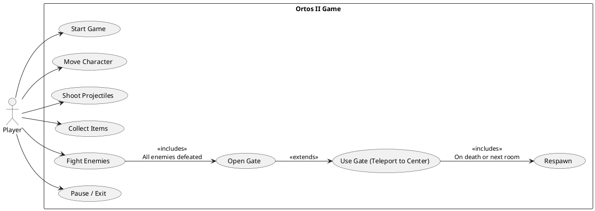

# Ortos II – Use Case Diagram (UML)

Below is a PlantUML use case diagram showing how the Player interacts with the game.

How to view
- Use any PlantUML renderer (e.g., VS Code PlantUML extension) to preview.
- Or copy the code block into an online PlantUML server to generate an image.

Key use cases (summary)
- Start Game: Begin a new session from the title menu.
- Move Character: Navigate the map with WASD.
- Shoot Projectiles: Attack using arrow keys to aim.
- Collect Items: Pick up items encountered in rooms.
- Fight Enemies: Engage and defeat enemies in the room.
- Open Gate: Gate becomes passable after all enemies are defeated.
- Use Gate (Teleport to Center): Transition action that teleports to room center.
- Respawn: Return after death or when entering a new room.
- Pause / Exit: Pause menu interactions and quitting the game.

